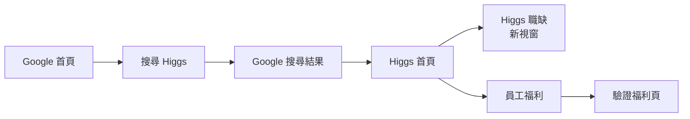

# Higgs Selenium E2E Assignment

這是一個 2023 年完成的 Selenium / Pytest 自動化測試作業，使用 Page Object Model 將一條跨站 E2E user journey 拆成可讀、可維護的測試流程。

> 這是一份歷史作品。測試依賴 Google 與 Higgs 外部網站的實際 DOM / URL，因此網站改版後不保證能直接執行；repository 主要保留當時的測試設計與後續重構成果。

## 測試情境

測試會依序驗證：

1. 開啟 Google。
2. 搜尋 `higgs tec. inc.`。
3. 從搜尋結果進入 Higgs 官網。
4. 驗證 Higgs 首頁已載入。
5. 點擊「Higgs 職缺」，確認開啟新的 browser window / tab。
6. 回到 Higgs 首頁並確認 URL。
7. 進入「員工福利」，確認福利頁標題顯示。



## 技術棧

- Python
- Pytest
- Selenium 4
- Page Object Model
- Explicit Wait / `WebDriverWait`
- python-dotenv
- Allure Report
- Selenium Manager

## 專案結構

```text
.
├── conftest.py
├── test_higgs_website.py
├── page_objects/
│   ├── google_index_page.py
│   ├── google_search_page.py
│   ├── higgs_home_page.py
│   └── higgs_benefits_page.py
├── utils/
│   └── page_base.py
├── .env-template
├── pytest.ini
├── requirements.txt
└── exec_test.sh
```

### Test layer

`test_higgs_website.py` 只描述 user journey 與 assertion，不直接處理 locator、scroll 或 wait 細節。

### Page Object layer

每個頁面物件只封裝該頁面的操作：

- `GoogleIndexPage`：輸入搜尋關鍵字。
- `GoogleSearchPage`：從搜尋結果進入目標網站。
- `HiggsHomePage`：首頁載入、職缺與福利入口。
- `HiggsBenefitsPage`：確認福利頁狀態。

### Base layer

`PageBase` 集中 Selenium 共用行為，包括：

- clickable / visible element wait
- click
- scroll into view
- 等待新 browser window

因此 Page Object 不需要自行放 `time.sleep()` 或跨 method 保存暫時的 Selenium element。

## 環境設定

建立 `.env`：

```bash
cp .env-template .env
```

設定：

```env
GOOGLE_DOMAIN=https://www.google.com
HIGGS_DOMAIN=https://your-higgs-domain.example
HEADLESS=false
```

`HIGGS_DOMAIN` 請填入實際要測試的 Higgs 網址。

若在 CI 或沒有圖形介面的環境執行，可設定：

```env
HEADLESS=true
```

## 執行方式

### 一鍵執行

```bash
bash exec_test.sh
```

`exec_test.sh` 會：

1. 建立 `.venv`（若尚未存在）。
2. 安裝 `requirements.txt`。
3. 執行 Pytest。
4. 若系統有安裝 Allure CLI，產生 HTML report。

也可以直接傳 Pytest 參數：

```bash
bash exec_test.sh -v -s
```

### 手動執行

```bash
python3 -m venv .venv
source .venv/bin/activate
python -m pip install -r requirements.txt
pytest
```

Pytest 會依 `pytest.ini` 將 Allure results 寫到 `allure-results/`。

若另外安裝了 Allure CLI：

```bash
allure generate ./allure-results/ -o ./allure-report/ --clean
```

## 重構重點

這份 repository 保留原始 assignment 的測試意圖，但後續將幾個容易造成 flaky test 的寫法整理掉：

| 原本寫法 | 整理後 |
| --- | --- |
| Google 搜尋按鈕依賴中文 `value` | 使用搜尋框 + Enter，降低 locale dependency |
| `time.sleep()` 等頁面 | 使用 explicit wait |
| Page Object 保存 Selenium element state | 每個操作即時取得 element，避免 stale state |
| `logging.info()` 被當成 assert message | 使用明確 assertion message |
| `Higgstar` / `Higgster` 命名 | 統一成 `Higgs*` |
| browser setup 與 env 直接散落在 test | 集中於 Pytest fixtures |
| 每次 script 都無條件重建 venv | venv 可重用，script fail fast |

## Allure 與 browser lifecycle

測試 fixture 在 teardown 時會嘗試附上最後一張 browser screenshot，再關閉 WebDriver。即使 screenshot capture 本身失敗，也不會阻止 browser cleanup。

Selenium 4 直接透過 Selenium Manager 管理 ChromeDriver，因此 repository 不需要 commit driver binary。

## 歷史背景與限制

這個專案最初是一次 Higgs automation assignment，也曾搭配 Jenkins 環境執行。現在保留它主要是作為一個小型 Selenium E2E / Page Object 作品。

由於流程跨越 Google 與 Higgs 真實網站，可能受到以下因素影響：

- Google 搜尋結果排序或 anti-bot 行為改變。
- Google / Higgs DOM、文字或 URL 改版。
- 「Higgs 職缺」是否仍以新視窗開啟。
- 歷史測試環境或 Jenkins infrastructure 已不存在。

因此這份 repository 比較適合用來閱讀 automation design，而不是當成對現行網站可永久穩定執行的 regression suite。
